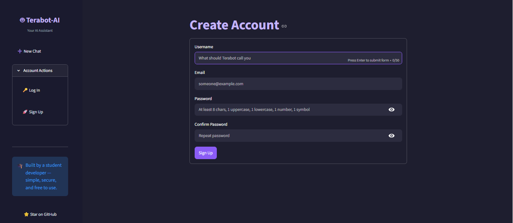
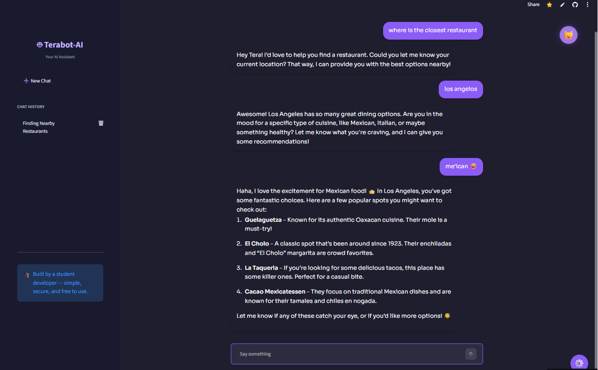
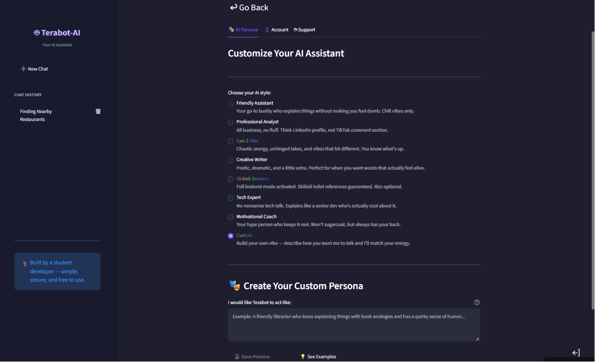

# 🤖 Terabot-AI

> An advanced, multi-persona AI chatbot workspace featuring secure out-of-band authentication, multi-tenant data isolation, and persistent conversation management.

**🔗 Live Demo:** https://terabot-ai.streamlit.app/  
**📅 Built:** Summer 2025

---

## 📝 What It Does

**Terabot-AI** is a personal AI chatbot web application built with **Streamlit**, **Firebase**, and the **OpenAI API**. It allows users to create authenticated accounts, manage independent conversation threads, and customize how the AI responds through reusable personas.

Rather than acting as a simple interface over an LLM, the project focuses on the engineering challenges involved in building a production-style multi-user platform. It implements a custom out-of-band email verification workflow, user-isolated Firestore data structures, dynamic persona management, and a secure multi-stage account deletion process.

---

## 🛠️ Tech Stack

- **Frontend & Framework:** `Streamlit` (Python)
- **Authentication:** `Firebase Authentication`
- **Database & Storage:** `Cloud Firestore`
- **Backend SDK:** `firebase-admin`
- **AI Integration:** `OpenAI API` (Chat Completions & Moderation)
- **Email Delivery:** `Gmail SMTP`
- **Hosting:** `Streamlit Community Cloud`

---

## ✨ Features

### 🔐 Gated Email Verification

  

New accounts require a time-sensitive six-digit verification code delivered by email before activation, reducing spam registrations and protecting server resources.

### 💬 Dynamic Conversation Workspaces

  

Conversation threads are stored independently, allowing users to switch between multiple discussions without mixing conversational context.

### 🎭 Custom Persona Engine

  

Users can create, edit, and save reusable AI personas by defining custom system instructions for different use cases, such as coding assistance, writing feedback, or general conversation.

### 🔄 Live Persona Switching

Personas can be swapped during an active conversation without resetting the interface, clearing chat history, or disrupting the current session state.

### 🗑️ Secure Account Deletion

A protected **Danger Zone** requires explicit text confirmation before permanently deleting authentication records and associated Firestore data.

---

## 🔒 Security Considerations & Technical Reflection

### Credential Handling

- **Safe Secrets Management:** OpenAI keys, Firebase service credentials, and Gmail SMTP passwords are stored outside the repository and injected securely at runtime using Streamlit's `st.secrets` mechanism.

- **Repository Safety:** Local configuration files containing sensitive information are excluded through a strict `.gitignore` policy to prevent accidental commits.

### Access Control & Data Isolation

- **Server-Side Authorization:** The application uses the `firebase-admin` SDK from the backend rather than exposing client-side administrative access. All database operations are scoped to the authenticated `session_user_id`, ensuring users can only access their own data through the application.

- **Usage Controls:** Guest accounts are limited to six messages to reduce abuse and protect API usage. Authenticated users are restricted to one in-flight AI request at a time; submitting another prompt before the previous response completes displays a **"please wait"** notice. Once a response completes, there is currently no additional per-minute or per-hour request limit.

### Input Validation & Security

- **XSS Mitigation:** User-controlled values such as usernames, persona titles, and prompt fields are sanitized using `html.escape()` before being rendered inside markdown blocks that allow HTML (`unsafe_allow_html=True`).

- **Moderation Coverage:** Custom persona instructions are validated through OpenAI's Moderation API before being stored. Standard chat messages currently rely on the underlying model's built-in safety systems rather than an additional moderation pass.

- **Exception Handling:** Some development-stage exception handlers currently expose raw Python errors through `st.error(f"... failed: {e}")`. While useful during debugging, these should be replaced with generic user-facing messages backed by structured server-side logging in production.

---

## 🧠 What I Learned

### Managing Streamlit's Execution Model

I learned how Streamlit's execution model works in practice, especially how the entire script reruns on every interaction. This required careful use of `st.session_state` to manage authentication state, chat history, and persona configurations.

### Backend Authorization

I worked with the `firebase-admin` SDK to understand how server-side authentication can act as a control layer for database access and verification workflows.

### NoSQL Data Modelling

Designing the Firestore structure helped me understand how to model NoSQL data for multi-user systems, especially when handling nested conversation and persona data while keeping strict separation between accounts.

### Secure Credential Management

This project reinforced the importance of secure credential handling, particularly separating sensitive keys from source code and injecting them securely at runtime.

---

## 🚀 Future Improvements

- [ ] Route live chat messages through the OpenAI Moderation API for consistent content filtering.
- [ ] Replace raw exception output with user-friendly error messages backed by structured server-side logging.
- [ ] Introduce stricter regex-based validation for usernames before database insertion.
- [ ] Implement configurable per-user request quotas and rate limits to better protect API resources as usage grows.
- [ ] Expand automated testing around authentication, verification, and account lifecycle workflows.
